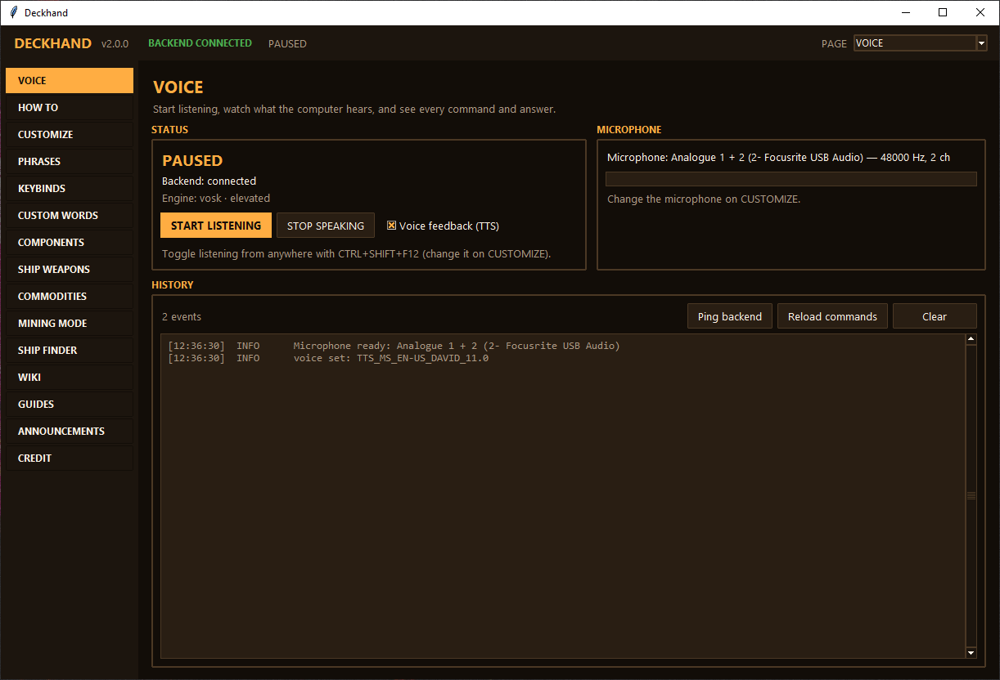
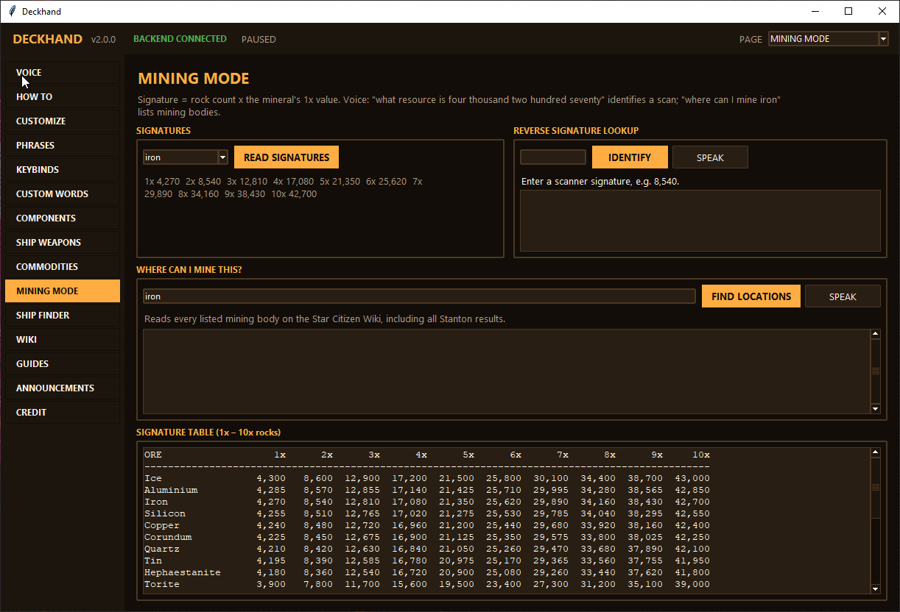
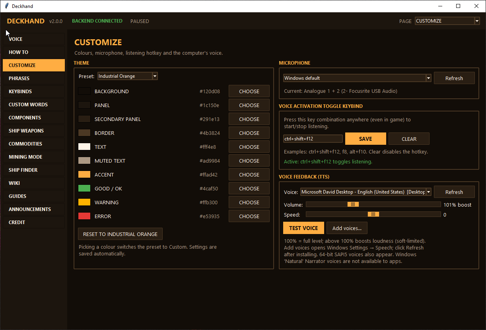

# Deckhand

**Offline voice commands for Star Citizen.** You fly; Deckhand handles the switches.

<p align="center">
  
</p>

Say "landing gear" and the key is pressed. Ask "where can I mine iron?" and you get the
answer out loud. Everything you say is recognized **on your PC**: no cloud, no account,
no lag from a round trip to a server. Deckhand's voice engine is a small native
program written in **Zig**, with a Python GUI for settings, editing and lookups.

> **Status:** v2.0.0 · Windows 10/11 x64 · English voice commands · 73 commands / 275 phrases ·
> 106 engine tests + 267 GUI tests.
>
> Deckhand is a fan-made tool, not affiliated with or endorsed by Cloud Imperium Games.

## Download

1. Grab **`Deckhand-v2.0.0.zip`** from the [latest release](../../releases/latest) and unzip it.
2. Install [Python 3.10+](https://www.python.org/downloads/) if needed (tick *Add python.exe to PATH*).
3. Double-click **`start.bat`**. Press **Ctrl+Shift+F12** and say "landing gear".

The zip includes the speech model and the engine; no Zig or extra downloads needed.
Building from source instead? See [Setup](#setup).

---

## Contents

- [Download](#download)
- [Why Deckhand](#why-deckhand)
- [Why Zig](#why-zig)
- [Local first: what runs on your PC](#local-first-what-runs-on-your-pc)
- [How Deckhand differs from the original app](#how-deckhand-differs-from-the-original-app)
- [Features](#features)
- [How it works](#how-it-works)
- [Roadmap](#roadmap)
- [Setup](#setup) · [Run](#run) · [Engine CLI](#engine-cli-reference) · [Tests](#tests) · [Layout](#layout) · [Releases](#releases)
- [Known limitations](#known-limitations) · [Credits](#credits)

---

## Why Deckhand

Deckhand started as a ground-up rewrite of a community Python app,
[Kabutopz Voice Protocol](https://github.com/Kabutopzzz/Kabutopz-Voice-Protocol). That
app is capable, but its voice loop has three limits that matter most mid-flight:

1. **Recognition is online.** Every phrase is sent to Google's web speech service. That
   needs an internet connection, sends your voice off your PC, and adds a network round
   trip to every command.
2. **Speech output is heavy.** Each spoken reply starts a new hidden PowerShell process to
   run `System.Speech`, with volume capped at 100.
3. **Everything is one process.** Around 5,200 lines in one Python file handle audio,
   recognition, key presses, speech and the GUI, which makes timing and threading hard to
   reason about and to test.

Deckhand keeps what players liked (the pages, phrases, keybind editing, spoken questions)
and rebuilds the voice path underneath as its own native engine.

## Why Zig

Zig suits the part of the app that talks to Windows and has to be fast and predictable:

- **Direct Windows APIs, no wrappers.** Microphone (WASAPI), speech (SAPI `ISpVoice`), key
  presses (`SendInput`), global hotkeys (`RegisterHotKey`) and the GUI link (named pipes)
  are called directly. COM interfaces are declared in Zig and their vtable layout is
  checked by unit tests, so a wrong method slot fails a test instead of crashing mid-game.
- **Predictable real-time behaviour.** No garbage collector and no interpreter in the
  audio loop. The mic is polled every 10 ms and audio is streamed to the recognizer
  *while you speak*, so the result is ready 4–9 ms (commands) or 5–44 ms (questions)
  after the end-of-phrase pause.
- **One small native executable.** The engine is a ~2.4 MB `deckhand.exe` plus the Vosk
  runtime DLLs, not a bundled Python interpreter. Bundled-interpreter builds are a common
  source of antivirus false positives; a plain native exe avoids that whole class of
  problem.
- **Explicit memory and errors.** Allocations and failures are visible in the code (Zig
  error unions), which is what you want in code that owns audio devices and COM objects.
- **Tests live next to the code.** `zig build test` runs 106 tests covering the command
  format, key mapping, voice detection, gain, echo guard, IPC protocol and COM layouts.

Honest trade-offs: Zig is pre-1.0, so Deckhand is **pinned to Zig 0.14.1**, and the GUI is
Python/Tkinter. The split is deliberate: native code where timing matters, Python where
fast UI iteration matters.

## Local first: what runs on your PC

| Part | Where it runs | Internet needed? |
|---|---|---|
| Speech recognition (Vosk: command grammar + free-form questions) | Your PC | **No** |
| Spoken replies (Windows SAPI voices, rendered in-process) | Your PC | **No** |
| Key presses, hotkeys, echo guard, voice detection | Your PC | **No** |
| Command, phrase and keybind editing | Your PC (`config/`) | **No** |
| Keybind questions ("what is N bound to?") | Your PC | **No** |
| Mining radar signature lookup | Your PC (built-in table) | **No** |
| Mining locations | Online, with a saved offline fallback list | Optional |
| Prices, components, ship weapons, ship finder, wiki | Online lookups (UEX, scunpacked, Star Citizen Wiki) | Yes |

Your voice never leaves the machine. Only the optional lookup pages go online, and the
UEX API key they can use is optional too.

## How Deckhand differs from the original app

| | Original (Kabutopz Voice Protocol v1.5, Python) | Deckhand |
|---|---|---|
| Speech recognition | Google web speech, **online** | **Vosk, offline**: grammar-constrained for commands, free-form for questions |
| Voice languages | **8** (EN, ES, IT, PT, GA, RU, FR, DE) | English (more planned, see [Roadmap](#roadmap)) |
| Spoken replies | New PowerShell process per reply, volume 0–100 | In-process SAPI, rendered to memory, **0–300 % gain** with soft limiter, voice + speed choice |
| Speech output device | Windows default | Default **or any output device** (WASAPI) |
| Stop talking | Voice phrase | Voice phrase, **STOP SPEAKING button** and **Ctrl+Shift+F11** hotkey |
| Hearing its own voice | 1.5 s cooldown | **Echo guard** (recognition muted while speaking + 500 ms) and the 1.5 s cooldown |
| Voice detection | Fixed thresholds (450 start / 160 trailing) | **Calibrated to your room noise**, 250 ms pre-roll so the first word isn't clipped |
| Microphone formats | 16-bit (`sounddevice`) | 16/24/32-bit and float (WASAPI shared mode) |
| Commands | 51 commands / 186 phrases | **73 commands / 275 phrases** (all of the original's phrases plus shield faces, VTOL, gimbal, throttle, look behind, freelook, scan, screenshot, …) |
| Editing commands | Phrases, keybinds, custom words pages | Same pages; changes **apply instantly** (hot reload), a bad file never replaces the working one |
| Mishearing tolerance | — | e.g. "might iron" → mine iron, "and" → key N (only when the context fits) |
| Architecture | One ~5,200-line Python file | Zig voice engine + Python GUI, talking over a named pipe ([docs/IPC.md](docs/IPC.md)) |
| Tests | None | **106** engine + **267** GUI tests |
| Packaging | PyInstaller one-folder build, GitHub Actions, SHA-256 | Ready-to-run 54 MB zip (native exe + `start.bat`, no Zig needed); CI release pipeline planned |
| Admin rights | Normal user by default | Normal user by default; admin build available for players who run the game as admin |

## Features

**Voice control**
- Offline command recognition with tap, hold and key-combo actions, including modifier +
  mouse actions such as ship zoom (Left Alt + right mouse).
- Toggle listening with **Ctrl+Shift+F12** (changeable in the GUI, warns if the key is
  already in use). "computer turn off" stops listening, "thank you computer" gets a reply.
- Spoken questions, answered out loud and shown on the matching page:
  - keybinds: "what is N bound to?", "what does F1 do?"
  - mining: "where can I mine iron?", "what resource is eight thousand five hundred forty?"
  - shopping: "where can I buy an Atlas component?", "where can I buy a Deadbolt five ship
    weapon?", "where can I rent a Cutlass Black?"
  - prices and lore: "what is the price of laranite?", "tell me about the Carrack"

<p align="center">
  <br>
  <sub>MINING MODE: rock signatures, reverse lookup of a scanner value, and where to mine each ore.</sub>
</p>

**Speech output**
- Pick any installed Windows voice, speed and volume (up to 300 %); "Add voices" opens the
  Windows speech settings.
- Choose the output device over the pipe or with `--tts-output` (a GUI picker is on the roadmap).
- Interrupt at any time: "robot stop talking", the STOP SPEAKING button, or Ctrl+Shift+F11.

<p align="center">
  <br>
  <sub>CUSTOMIZE: 6 themes or your own colours, microphone, listening hotkey, voice, volume and speed.</sub>
</p>

**GUI pages**
VOICE (status, mic meter, history) · HOW TO · CUSTOMIZE (6 themes + custom colour,
microphone, hotkey, voice) · PHRASES · KEYBINDS · CUSTOM WORDS · COMPONENTS · SHIP WEAPONS ·
COMMODITIES · MINING MODE (with reverse signature lookup) · SHIP FINDER · WIKI · GUIDES ·
ANNOUNCEMENTS · CREDIT.

## How it works

```
 microphone ──► WASAPI capture ──► voice detection ──► Vosk (commands) ──► SendInput ──► game
                  (noise-calibrated, echo guard)   └─► Vosk (free-form) ──► question ─┐
                                                                                        │
 speakers ◄── WASAPI output ◄── gain ◄── SAPI voice ◄── reply text ◄────────────────────┤
                                                                                        ▼
                 deckhand.exe (Zig)  ◄════ named pipe \\.\pipe\deckhand ════►  GUI (Python/Tkinter)
                                           JSON messages, docs/IPC.md          pages, editing, lookups
```

The engine owns audio, recognition, key presses and speech. The GUI shows status, answers
questions with online data, and edits `config/commands.json`, which the engine reloads
without a restart. The command file format is in [docs/COMMANDS.md](docs/COMMANDS.md).

## Roadmap

**Next up**
- **More languages.** Plan: one Vosk model per language (~40–50 MB each, downloaded on
  demand), per-language phrase sets in the command file, a language selector that swaps
  model and grammar at runtime through the existing hot-reload path, and translated GUI
  text. Spanish, Italian, Portuguese, Russian, French and German have Vosk models; Irish
  has no official model yet, so it needs a community model or has to wait.
- **GUI settings** for the speech output device and the stop-speaking hotkey (the engine
  already supports both).
- **Release pipeline:** GitHub Actions build, `SHA256.txt` and version info in the exe.

**Later**
- **Echo cancellation**, so "robot stop talking" works over speakers too (today the
  hotkey or button is the reliable way to interrupt speech).
- **Speech output hardening:** follow device changes and unplugging, measure latency across
  headsets, USB DACs, HDMI and Bluetooth, then drop the legacy fallback.
- **Better free-form recognition** for item and ship names (a larger model or Whisper).
- **One-click recovery** when `config/commands.json` is broken ("Reset to defaults").

---

## Setup

**Prerequisites:** Windows 10/11 x64 · **Zig 0.14.1 exactly** (`winget install zig.zig --version 0.14.1`,
or https://ziglang.org/download/0.14.1/; 0.15+ breaks the build) · Python 3.10+ for the GUI.
The scripts run on the PowerShell built into Windows.

**Easiest:** double-click **`start.bat`**. On first run it offers to download the offline speech
model and the Vosk runtime (about 56 MB, one time), builds the engine, installs the GUI's
Python packages and starts Deckhand. If anything is missing it says what and how to fix it.

Manual setup:

```powershell
# Vosk speech model + vosk-api DLL/lib bundle (~56 MB). Add -Whisper for the unused Whisper model.
.\scripts\fetch_models.ps1

# GUI dependencies.
python -m venv .venv
.\.venv\Scripts\Activate.ps1
pip install -r frontend\requirements.txt

# Optional: UEX API key for commodity lookups (works without one, may be rate-limited).
copy .env.example .env
notepad .env

# Build the engine (debug: no UAC prompt). Release: zig build -Doptimize=ReleaseFast
zig build
```

`zig build` links `vendor/vosk-api/libvosk.lib` when present; without it the exe still
builds but `--listen` exits with a clear error (`start.bat` rebuilds such an exe
automatically once the Vosk runtime is there). The release build embeds a
`requireAdministrator` manifest; override with `-Delevate=true|false` (`package.ps1` builds
without it unless given `-Elevated`). Windows only lets a
program send keys to a game running as admin if it runs as admin too.

## Run

Double-click **`start.bat`**. It stops any old instance, rebuilds the engine when needed
(missing, built without Vosk, or Zig sources changed), starts it hidden and opens the GUI
(no console window). If the engine stops right after starting, a message shows the reason
instead of a silent "disconnected". Default hotkeys: **Ctrl+Shift+F12** toggles listening,
**Ctrl+Shift+F11** stops speech. Set `DECKHAND_ZIG` to a `zig.exe` path if Zig 0.14.1 isn't
found automatically.

Manual start (two terminals):

```powershell
zig-out\bin\deckhand.exe --listen --hotkey "ctrl+shift+f12" --stop-hotkey "ctrl+shift+f11" --ipc
python frontend\deckhand_ui.py
```

GUI settings live in `config/ui_settings.json`, your command edits in `config/commands.json`
(the shipped `commands.default.json` is never modified). Logs go to `%TEMP%`:
`deckhand-start.log` (launcher), `deckhand-backend.log`, `deckhand-frontend.log` and
`deckhand-build.log`.

**Troubleshooting:** GUI says *disconnected* or the mic does nothing → run `start.bat` again
and read its message, or check `%TEMP%\deckhand-start.log` and `%TEMP%\deckhand-backend.log`.
The usual cause is a missing speech model (let `start.bat` download it) or another app
holding the hotkey.

## Engine CLI reference

```
deckhand.exe [flags]

  --version           print version and exit
  --check-elevation   exit 0 if elevated, 1 if not
  --regen-grammar     regenerate generated/ grammar files from the command file
  --list-commands     list all loaded command IDs and phrases
  --fire <id>         send the SendInput sequence for command <id>
  --hotkey <chord>    register hotkey (e.g. "ctrl+shift+f12") and print when pressed
  --dump-audio <sec>  capture the default mic, dump VAD-detected chunks to dump_NNN.wav
  --say <text>        speak <text> and exit; options: --voice <token id>,
                      --volume <0-300> (percent), --rate <-10..10>
  --ipc-only          start the named-pipe server without audio/recognizer
  --listen            full voice loop (audio → Vosk → SendInput). Options:
                        --hotkey <chord>       toggle listening (starts paused)
                        --stop-hotkey <chord>  stop speaking immediately
                        --ipc                  also start the named-pipe server for the GUI
                        --no-tts               disable spoken acknowledgements
                        --model <path>         Vosk model dir (default models\vosk-model-small-en-us)
                        --grammar <path>       Vosk grammar JSON (default generated\commands.vosk.json)
                        --device <id>          capture endpoint id (default: Windows default mic)
                        --tts-output <id>      render endpoint id for speech (default speaker)
                        --tts-legacy           play speech via PlaySoundW instead of WASAPI
                        --replay-wav <wav>     (test) feed a 16 kHz WAV through the voice path
  --decode-wav <wav>  decode 16 kHz WAVs; prints text, match, question verdict, latency
  --help              this message
```

## Tests

```powershell
zig build test --summary all                                  # engine: 106 tests
cd frontend; python -m unittest discover -s tests             # GUI: 267 tests
```

## Layout

```
build.zig, build.zig.zon, start.bat         ← one-click launcher (hidden engine + GUI)
backend/
  resources/  deckhand.rc + app.manifest + app.asinvoker.manifest
  src/
    main.zig, listen.zig, config.zig, dispatch.zig, actions.zig, cooldown.zig,
    question.zig, requests.zig, elevation.zig
    grammar/codegen.zig                     ← JSON → GBNF + Vosk JSON
    input/{vk_map,modifiers,sendinput,hotkey}.zig
    audio/{com,wasapi,vad,wav}.zig          ← WASAPI capture + energy VAD
    recognizer/{recognizer,vosk,whisper}.zig
    tts/{sapi5,wasapi_out,gain,echo_guard}.zig ← SAPI render → gain → WASAPI output
    ipc/{protocol,pipe_server}.zig          ← named-pipe JSON messages
frontend/
  deckhand_ui.py, ipc_client.py, app_paths.py, requirements.txt
  pages/      one module per GUI page (see pages/base.py for the contract)
  services/   command store, questions, UEX, wiki, scunpacked, mining data, themes, settings
  tests/      unittest suite
config/     commands.default.json (73 commands), commands.schema.json
docs/       IPC.md (pipe protocol), COMMANDS.md (command file format), images/ (screenshots)
models/     (fetched by scripts/fetch_models.ps1)
vendor/     (fetched by scripts/fetch_models.ps1)
scripts/    start.ps1 (launcher logic behind start.bat), fetch_models.ps1, package.ps1
.github/    workflows/release.yml (build, test, package, publish), RELEASE_NOTES.md
```

`.\scripts\package.ps1` builds `release\Deckhand-v2.0.0.zip` (~54 MB): the exe
and its DLLs, the speech model, GUI, config, docs and `start.bat`, laid out so users just unzip and
double-click `start.bat` (no Zig needed).

## Releases

`.github/workflows/release.yml` builds on a clean Windows runner: installs Zig 0.14.1
(checksum-verified), fetches the model, runs both test suites, packages the zip and writes
`SHA256.txt`.

- **Test run:** GitHub → Actions → *Release* → *Run workflow*. The zip is attached to the run
  as an artifact; nothing is published.
- **Publish:** bump `APP_VERSION` in `frontend/app_paths.py` (plus `VERSION` in
  `backend/src/main.zig` and `build.zig.zon`), update `.github/RELEASE_NOTES.md`, then
  `git tag v2.0.0 && git push origin v2.0.0`. The workflow refuses a tag that doesn't match
  `APP_VERSION`, then creates the release with the zip and checksum attached.

## Known limitations

- English voice commands only (see [Roadmap](#roadmap)).
- Vosk's small free-form model can mishear unusual item or ship names; common mishearings
  are handled, rare ones may need a second try.
- Over speakers, the mic hears Deckhand's own speech; the echo guard prevents false
  commands, but it also means you can't talk over it. A headset avoids this.
- Mining signature values come from the original app's table; the wiki may list newer
  values for the current patch.
- The Whisper.cpp recognizer is stubbed out; Vosk handles both commands and questions.
- No auto-updater and no GPU acceleration.

## Credits

Deckhand is an independent rewrite with its own voice engine and GUI shell. Its default
phrases and mining tables come from
[Kabutopz Voice Protocol](https://github.com/Kabutopzzz/Kabutopz-Voice-Protocol) by
[Kabutopzzz](https://github.com/Kabutopzzz) and contributors. Thank you. That repository
has no license file, so reuse of its phrases and data depends on its author's permission.

Lookup data comes from [UEX](https://uexcorp.space/), the
[Star Citizen Wiki](https://starcitizen.tools/) and scunpacked. Star Citizen is a
trademark of Cloud Imperium Games; Deckhand is not affiliated with or endorsed by it.
